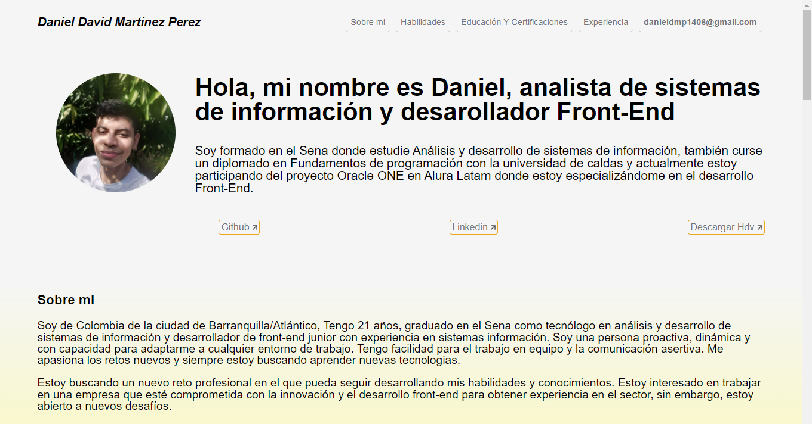
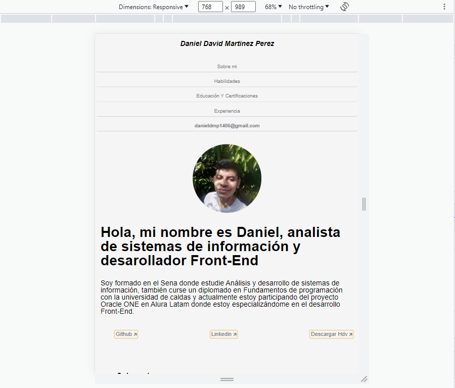
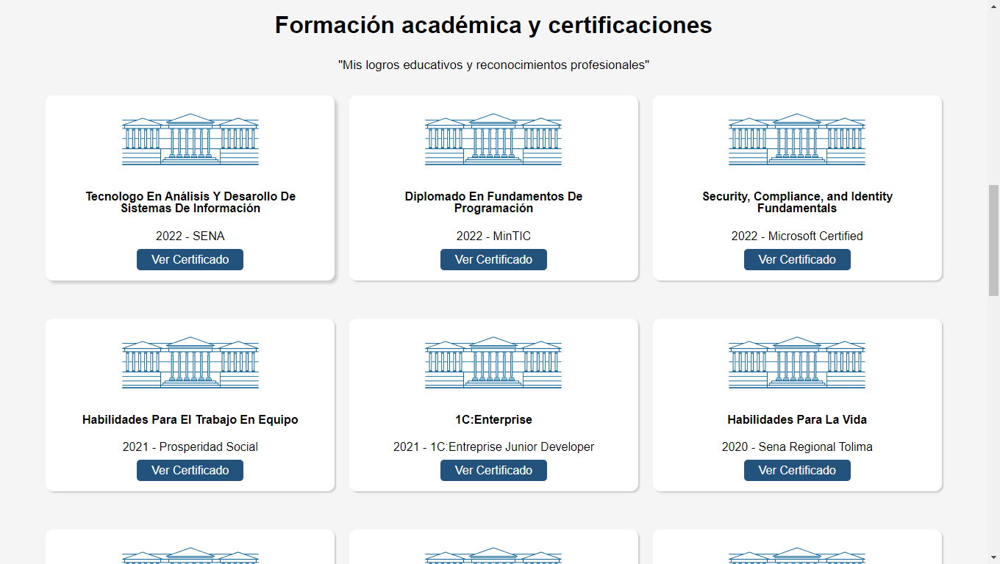
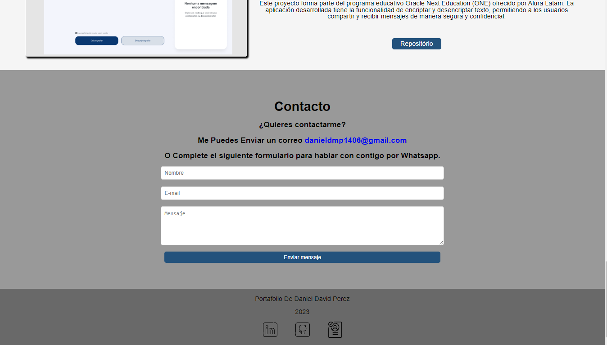

# Front End -  Portafolio
# challengeoneportafolio5

     

### ¡Bienvenido A Mi Portafolio:
---
#### Hola mi nombre es DANIEL DAVID MARTINEZ y este es mi portafolio⭐
#### Este portafolio tiene información acerca de mí, mi educación y mis certificaciones, además de mis experiencias profesionales y proyectos personales.

### Analisando el repositorio!
---
### Este es el contenido de mi portafolio:
#### 🔹El portafolio es responsivo por lo cual es compatible con dispositivos mobiles.

     

#### 🔹En el se podra ver o descargar los certificados de estudios.

     

#### 🔹Tiene una sección de contacto donde se podrán comunicar conmigo por la app de WhatsApp.

     

### Entrar a mi Portafolio
---
## Para entrar a mi portafolio solo debes dar click al link de abajo.

🔹 [Link de La Página](https://mddaniel1.github.io/Portafolio/)

